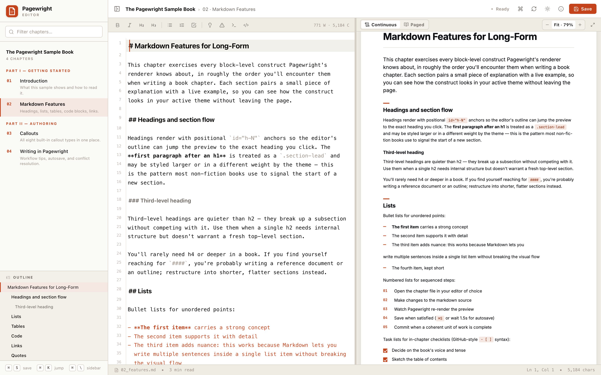
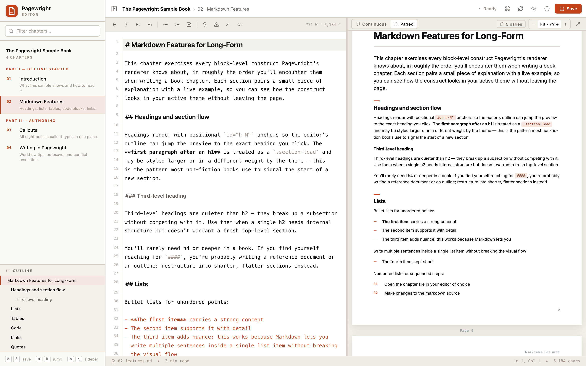
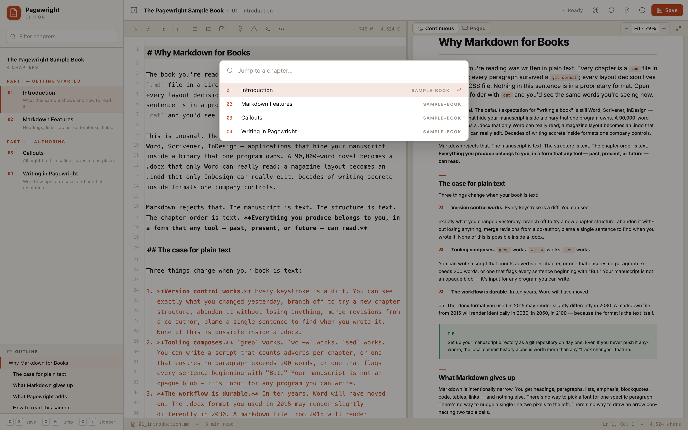
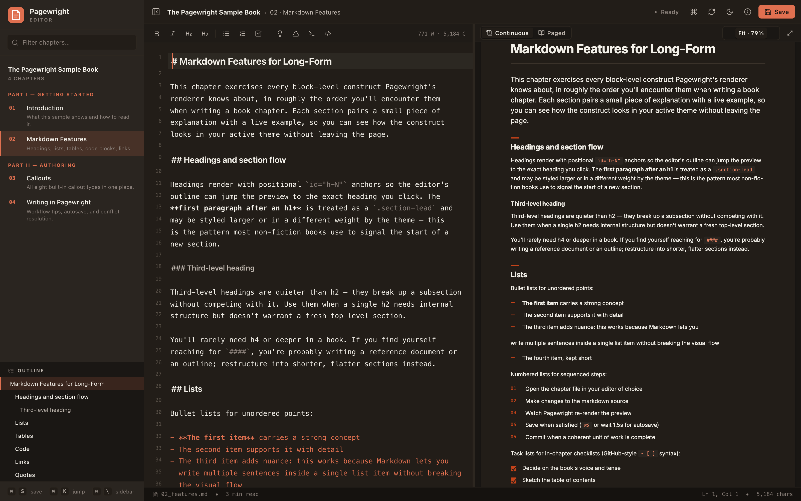
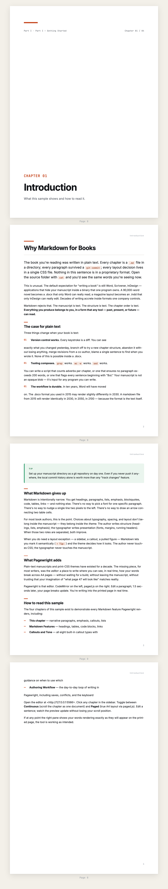
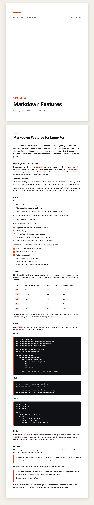

<div align="center">

# Pagewright

### The missing book editor for Markdown.

**CodeMirror on the left. True paged A4 preview on the right.
Every page break updates as you type.**

[](https://github.com/Mavengence/pagewright/actions/workflows/test.yml)
[](LICENSE)
[](pyproject.toml)
[](https://pagedjs.org)
[](tests/)
[](#status)

[**Quick start**](#quick-start) ·
[**Features**](#what-you-get) ·
[**Themes**](#themes) ·
[**Comparison**](#how-it-compares) ·
[**Showcase**](#showcase)

</div>

---



## What it is

Pagewright is a **local-first book editor for Markdown authors**. You
write in CodeMirror; you see your manuscript laid out as A4 pages
in real time via [paged.js](https://pagedjs.org/); your work is saved
atomically into plain `.md` files in a directory you control.

It is not a notebook. It is not a knowledge graph. It is not a
markdown previewer. It is built for one job: **writing books, papers,
and long-form documents** where the printed page matters.

## Made for

| You are…                                          | Why Pagewright fits                                                                          |
|---------------------------------------------------|----------------------------------------------------------------------------------------------|
| **Writing a book** in Markdown                    | Multi-chapter project model. Watch your page breaks update as you type. Theme = print CSS.   |
| **Self-publishing** non-fiction or fiction        | Local-first. No cloud. Your manuscript is plain text, in `git`, owned by you.                |
| **Drafting a long paper or report**               | A4 preview matches what you'll print. Atomic saves + ETag conflict detection.                |
| **Building a custom typography system**           | Themes are just `theme.css` + an optional opener template. No build step, no preprocessor.   |
| **A publisher** with an in-house design system    | Ship your CSS as a theme. Your authors write Markdown; the design stays consistent.          |

## Not for

| You are…                                          | Use this instead                              |
|---------------------------------------------------|-----------------------------------------------|
| Writing notes / building a knowledge graph        | [Obsidian](https://obsidian.md), [Logseq](https://logseq.com) |
| Writing a single-doc blog post                    | Any markdown editor; Pagewright is overkill.  |
| Writing in LaTeX                                  | [Overleaf](https://overleaf.com)              |
| Collaborating in real time with co-authors        | [Vivliostyle](https://vivliostyle.org), [Ketty](https://github.com/coko-foundation/ketty) |
| Using Word and exporting to PDF                   | Word, then.                                   |

---

## Quick start

```bash
# Clone the repo to get the bundled sample book
git clone https://github.com/Mavengence/pagewright
cd pagewright
pip install -e .

# Run the editor against the sample
pagewright examples/sample-book
```

Open <http://127.0.0.1:5566>. You're writing.

> PyPI publication is on the [roadmap](#roadmap). Until then,
> install from source with `pip install -e .` (editable) or
> `pip install git+https://github.com/Mavengence/pagewright.git`.

For your own book, create a directory with one `pagewright.yaml` and
one markdown file per chapter:

```yaml
# pagewright.yaml
title:  "My Book"
author: "Your Name"
theme:  default

parts:
  - title: "Part I"
    chapters:
      - file: 01_intro.md
        title: "Introduction"
        description: "Why this book exists."
      - file: 02_chapter.md
        title: "First Chapter"
```

Then point Pagewright at it:

```bash
pagewright path/to/my-book
```

That's the entire setup. No config in your home directory, no global
state, no build step. Quit Pagewright and your book is just a folder
of `.md` files.

---

## A two-minute tour

### Live A4 preview

The right pane has two modes. **Continuous** scrolls the chapter as
one tall HTML document. **Paged** uses paged.js to lay it out into
discrete A4 pages with running headers, page numbers, and proper
`break-inside` handling — exactly what your final PDF will produce.



Switch with one click in the preview header. No rebuild.

### Position-stable hot reload

Edit a paragraph. 1.5 seconds after the last keystroke, Pagewright
autosaves your file and re-renders the preview. The heading at the
top of your viewport before the reload is at the top after — no
scroll-to-top, no animation, no losing your place.

This is what makes the *Paged* preview usable while writing. paged.js
re-paginates in 1–3 seconds; you land back on the same A4 page, not
back at page 1.

### Outline-driven navigation

The left sidebar shows your chapter's outline (h1 / h2 / h3). Click
a heading and the editor cursor jumps to that line **and** the
preview scrolls to the matching `#h-N` anchor. Click anywhere in the
editor and the corresponding outline entry highlights. You can
navigate a 30,000-word chapter without using the scrollbar.

### Command palette + filter

`⌘K` opens the jump-to-chapter palette. `⌘/` focuses the chapter
filter in the sidebar. Both fuzzy-match against book titles and
chapter titles.



### Dark mode

Auto / Light / Dark cycle. The preview iframe inherits the
preference; themes opt in to dark via `data-color-scheme="dark"`
selectors in their CSS.



---

## Showcase

The bundled `default` theme — clean modern paper-on-cream with an
ember accent — rendered through both preview modes.

<table>
<tr>
<td></td>
<td></td>
</tr>
</table>

The renderer is theme-agnostic — `default` is a reference
implementation, not a built-in. Drop your own under
`src/pagewright/themes/<name>/` or pass an absolute path with
`--theme`. See [`docs/themes.md`](docs/themes.md) for the full
theme-author guide.

---

## What you get

- **Two preview modes** — Continuous (scrolling) and Paged (true A4
  via paged.js with running headers + page numbers).
- **Position-stable hot reload** — your viewport heading stays at the
  top across re-renders. Works in both modes.
- **Outline-driven navigation** — click a heading, cursor jumps,
  preview scrolls. Bidirectional.
- **Atomic saves** — temp file + `os.replace`. A killed process never
  leaves a half-written file.
- **ETag conflict detection** — if the file changed under you (other
  editor, `git pull`), the server returns `409 Conflict` and the
  editor opens a Reload / Overwrite / Cancel dialog.
- **3× retry with exponential backoff** — transient save failures
  retry [0, 400, 1200] ms. On exhaustion: persistent toast with a
  Retry action; your edits stay in the editor.
- **Eight semantic callouts** — Note / Tip / Warning / Important /
  Example / Definition / Quote / Code. Theme-overridable labels (so
  themes for other languages can ship their own marker words).
- **Dark mode** — Auto / Light / Dark, persisted, system-aware.
- **Zoom + fit-to-width** — `⌘+`, `⌘−`, `⌘0`, or the segmented
  control in the preview header.
- **Command palette** — `⌘K` to jump between chapters.
- **No cloud, no auth, no telemetry** — runs on `127.0.0.1` against
  your local files.

---

## How it compares

|                              | Pagewright | pixel-and-paper | Vivliostyle  | Quarto / mdBook | Obsidian / Typora | Ketty / Editoria | Overleaf |
|------------------------------|:---------:|:---------------:|:---------------:|:---------------:|:-----------------:|:----------------:|:--------:|
| Markdown source              |    ✅     |       ✅        |    ✅ (VFM)     |       ✅        |        ✅         |    ❌ (Word)     | ❌ (TeX) |
| Multi-chapter project        |    ✅     |  ⚠️ filenames  | ⚠️ single-doc  |       ✅        |     ⚠️ flat      |        ✅        |    ✅    |
| Live preview                 |    ✅     |   ⚠️ watch     |       ✅        |  ⚠️ rebuild    |        ✅         |        ✅        |    ✅    |
| **True paged A4 preview**    |   **✅**  |     **✅**      |     **✅**      |       ❌        |        ❌         |       ✅         |    ✅    |
| Built-in editor              |    ✅     |       ❌        |       ✅        |       ❌        |        ✅         |        ✅        |    ✅    |
| Local-first                  |    ✅     |       ✅        |   ❌ (cloud)    |       ✅        |        ✅         |   ❌ (server)    | ❌ (cloud) |
| Atomic saves + ETag conflict |    ✅     |       ❌        |       ❌        |       —         |        —          |        —         |    —     |
| Position-stable hot reload   |    ✅     |       ❌        |       —         |       —         |        —          |        —         |    —     |

Pagewright is the only project at the full intersection: a local-first
multi-chapter book editor with true paged A4 preview, production-grade
save semantics, and an opinionated default theme.

The closest neighbours each give up something Pagewright keeps:

- [**pixel-and-paper**](https://github.com/the-coded-type/pixel-and-paper) — paged.js + local + markdown, but **bring your own editor** (the README literally says "use Obsidian or VS Code"). No project model beyond filename ordering.
- [**Vivliostyle**](https://vivliostyle.org/) — paged-media engine + an authoring app (the [Pub editor](https://github.com/vivliostyle/vivliostyle.pub) was a cloud-hosted, single-document, GitHub-login interface; project is dormant).
- [**Quarto**](https://quarto.org), [**mdBook**](https://rust-lang.github.io/mdBook/), [**Bookdown**](https://bookdown.org/), [**Honkit**](https://honkit.netlify.app/) — excellent CLI build tools, but **no live paged preview**. You edit, you re-build, you reload.
- [**Ketty / Editoria**](https://github.com/coko-foundation/ketty) — production-grade book authoring for university presses, but **not Markdown** (Word import, ProseMirror) and a 10-microservice deploy.

---

## Themes

A theme is a directory shipped with Pagewright (or a folder you own)
containing one to three files:

```
my-theme/
├── theme.css                # Required. Your print-CSS.
├── theme.yaml               # Optional. Callout label overrides.
└── chapter_opener.html      # Optional. Per-chapter front-page template.
```

Resolve a theme by built-in name or by absolute path:

```bash
pagewright my-book --theme default
pagewright my-book --theme ./themes/my-house-style/
```

Or set it once in `pagewright.yaml`:

```yaml
theme: ./themes/my-house-style/
```

The CSS is your A4 print stylesheet — `@page` rules, running headers,
page-number counters, the lot. Pagewright wraps it in continuous- or
paged-mode overrides at preview time but never modifies your rules.
The same theme.css drives the live preview *and* the final PDF
render — there's only one source of truth.

See [`docs/themes.md`](docs/themes.md) for the full theme-author
guide, including the rendered HTML structure, `@page` recipes, and
the `chapter_opener.html` placeholder set.

### Callouts

Eight semantic callouts ship in the default theme. Each is an
extended blockquote prefixed with a `**Label:**` marker:

```markdown
> **Tip:** Practical, actionable advice the reader can apply right now.

> **Warning:** Real consequences if ignored. Use sparingly.

> **Important:** A non-negotiable point. Higher gravity than a tip.
```

Theme authors override the labels via `theme.yaml`:

```yaml
callouts:
  - { label: "Astuce:", css_class: "callout-tip",     display: "Astuce" }
  - { label: "Attention:", css_class: "callout-warning", display: "Attention" }
```

…so a French theme's `> **Astuce:**` and the default English
`> **Tip:**` both produce the same `<div class="callout callout-tip">`.

---

## Keyboard shortcuts

| Key                  | Action                       |
|----------------------|------------------------------|
| `⌘S`                 | Save now                     |
| `⌘B` / `⌘I`          | Bold / italic                |
| `⌘F`                 | Find in current file         |
| `⌘K`                 | Jump-to-chapter palette      |
| `⌘/`                 | Focus chapter filter         |
| `⌘\`                 | Toggle sidebar               |
| `⌘+` / `⌘−` / `⌘0`   | Zoom preview (in/out/fit)    |
| `?`                  | Show keyboard help           |
| `Esc`                | Close palette / dialog       |

---

## Production-readiness

This isn't a weekend project that happens to work.

- **Atomic writes** — every save goes through a sibling `.tmp` file
  and `os.replace`. A killed process never leaves a half-written file.
- **ETag-based conflict detection** — every load returns
  `ETag: <mtime_ns>`; every save sends `If-Match`. The server returns
  `409 Conflict` if the file changed underneath, and the editor
  opens a Reload / Overwrite / Cancel resolution dialog.
- **Retry policy** — 3× exponential backoff (0 / 400 / 1200 ms) on
  transient save failures (network, 5xx, 408, 429). Persistent toast
  with **Retry** on exhaustion. Your edits stay in the editor.
- **No-cache headers** — Flask sets `Cache-Control: no-store` on `/`,
  `/static/*`, and `/api/*`. CSS/JS changes land on next reload, no
  hard-refresh needed.
- **Path-traversal safe** — every asset access is sandboxed inside
  the book directory; `..` returns 404.
- **Throttled side effects** — word count + outline rebuild debounce
  at 200 ms so 50 KB chapters stay snappy under burst typing.
- **Resilient layout** — `ResizeObserver` + `fonts.ready` + RAF
  refreshes catch every layout shift CodeMirror needs to remeasure
  (split drag, sidebar toggle, full-screen, web-font load).

---

## Architecture

```
pagewright/
├── src/pagewright/
│   ├── cli.py             ← argparse entrypoint (`pagewright …`)
│   ├── server.py          ← Flask app: atomic saves, ETag, no-cache
│   ├── renderer.py        ← Markdown → HTML, theme-aware, mode-aware
│   ├── markdown.py        ← Self-contained markdown converter
│   ├── theme.py           ← Theme loader (built-in + custom paths)
│   ├── config.py          ← `pagewright.yaml` schema + loader
│   ├── static/            ← Editor UI (HTML + CSS + JS)
│   └── themes/            ← Built-in themes (default)
├── examples/sample-book/  ← Runnable sample (the book you read above)
├── docs/                  ← Theme guide, configuration, architecture
└── tests/                 ← Playwright test suite
```

The editor is a single-page Flask app. The renderer turns one chapter
into a standalone HTML document; the editor iframe loads it from
`/api/preview?path=…`. Saves go through `/api/file` with `If-Match`
ETag headers — the server returns `409 Conflict` if the file changed
under you, and the editor opens a resolution dialog.

See [`docs/architecture.md`](docs/architecture.md) for the request
flow diagram and extension points.

---

## Build the PDF

Pagewright is the *editor*. To produce a final PDF, point your
favourite print-CSS engine at the same theme CSS the preview uses:

```bash
# WeasyPrint (Python, recommended)
weasyprint preview.html my-book.pdf

# paged.js-cli (Node — npm install -g pagedjs-cli)
pagedjs-cli preview.html -o my-book.pdf

# Prince (commercial)
prince preview.html -o my-book.pdf
```

All three engines honour the same `@page` rules, `string-set` running
headers, and `break-inside` hints your theme defines, so the output
matches the on-screen preview.

A `pagewright build my-book.pdf` command that glues the renderer to
WeasyPrint or paged.js-cli is on the [roadmap](#roadmap). Today,
write a 30-line Python script that imports `render_chapter_html`
and pipes the output to your engine of choice — see
[`docs/architecture.md`](docs/architecture.md) for an example.

---

## Roadmap

The shipped editor is feature-complete for single-author book writing.
The high-leverage future work, in order:

1. **PyPI publication** — `pip install pagewright` will Just Work.
2. **`pagewright build my-book.pdf`** — single-command full-book PDF
   build via WeasyPrint or paged.js-cli.
3. **More themes** — academic (Latin Modern + footnotes + bibliography),
   fiction-novel (single column + drop caps + generous leading),
   technical-reference (multi-column, callout-heavy).
4. **Per-chapter image references** — `` resolved
   against `book-asset/`. (Currently themes manage their own assets.)
5. **`pagewright init`** — scaffold a new book directory in one command.

PRs welcome on any of the above.

---

## Status

**Beta.** The API is stable; the data model (`pagewright.yaml`,
theme directory shape) is unlikely to change incompatibly. Issues
and PRs welcome.

---

## Limitations

- **Single-chapter preview only.** For full-book layout (cover, TOC,
  back-matter) build the PDF with WeasyPrint or paged.js-cli.
- **Single user, single tab.** Two browser tabs editing the same file
  conflict-detect each other on save.
- **No inline markdown images.** Themes manage their own image assets
  via theme directories. (Patches welcome.)
- **English default callouts only.** Other languages need a custom
  `theme.yaml`.

---

## Credits

Built by [**@Mavengence**](https://github.com/Mavengence).

Standing on the shoulders of:

- [**paged.js**](https://pagedjs.org/) — the print-CSS polyfill that
  makes the paged preview real.
- [**CodeMirror 5**](https://codemirror.net/5/) — the editor.
- [**Lucide**](https://lucide.dev/) — the icon set.
- [**Inter**](https://rsms.me/inter/) +
  [**JetBrains Mono**](https://www.jetbrains.com/lp/mono/) — the
  default theme's typography.

## Contributing

PRs welcome. The codebase is small (≈4,000 LOC across Python + JS) and
well-commented. 68 tests cover the markdown converter, config loader,
theme system, renderer, and every Flask endpoint.

```bash
git clone https://github.com/Mavengence/pagewright
cd pagewright
pip install -e ".[dev]"
pytest tests/ -v
```

See [`CONTRIBUTING.md`](CONTRIBUTING.md) for the full guide.

## License

[MIT](LICENSE).
